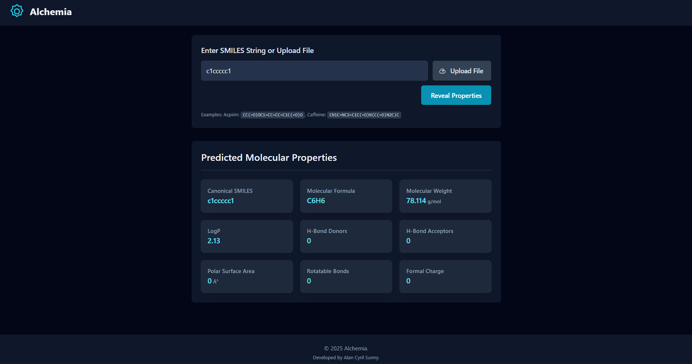

# Alchemia 🧪✨


> If you find this project helpful, please consider ⭐ [starring the repository](https://github.com/dragonpilee/alchemia)!

---

**Alchemia** is a web application that leverages the power of Google's Gemini AI to predict key molecular properties from SMILES (Simplified Molecular Input Line Entry System) strings. It provides chemists, researchers, and students with quick insights into the physicochemical characteristics of chemical compounds.

---



---

## 🌟 Key Features

- **Molecular Property Prediction:** Enter a SMILES string and get predictions for:
    - Canonical SMILES
    - Molecular Formula
    - Molecular Weight (g/mol)
    - LogP (Octanol-Water Partition Coefficient)
    - Number of Hydrogen Bond Donors
    - Number of Hydrogen Bond Acceptors
    - Topological Polar Surface Area (TPSA in Ų)
    - Number of Rotatable Bonds
    - Formal Charge
- **SMILES Input:**
    - Directly type or paste a SMILES string.
    - Upload a SMILES string from a `.smi` or `.txt` file.
- **Responsive Design:** User-friendly interface that works on various screen sizes.
- **Clear Visualizations:** Predicted properties are displayed in an easy-to-read card format.
- **Loading & Error States:** Provides feedback during API calls and displays clear error messages.
- **Dark Theme:** Aesthetically pleasing, chemistry-inspired dark theme.

---

## 🛠️ Tech Stack

- **Frontend:** React, TypeScript, Tailwind CSS
- **AI Model:** Google Gemini API (`gemini-2.5`) via `@google/genai` SDK
- **Module Loading:** ES Modules with `importmap` for browser-native module resolution.

---

## 🚀 Getting Started

### Prerequisites

- A modern web browser that supports ES Modules and `importmap`.
- A Google Gemini API Key.

### Setup and Running

1. **Clone the Repository (Optional - if running locally from source):**
    ```bash
    git clone <repository-url>
    cd alchemia
    ```

2. **Set up your API Key:**
    The application expects the Google Gemini API key to be available as an environment variable named `API_KEY`.
    - **For local development (browser-only):**
        Open `services/geminiService.ts` and temporarily hardcode your API key for testing:
        ```typescript
        // filepath: services/geminiService.ts
        // ...existing code...
        const getApiKey = (): string => {
          // const apiKey = process.env.API_KEY; // Original
          const apiKey = "YOUR_ACTUAL_API_KEY"; // Replace with your key for local testing
          if (!apiKey) {
            throw new Error("API_KEY environment variable not set or hardcoded key is missing.");
          }
          return apiKey;
        };
        // ...existing code...
        ```
        **Remove your hardcoded API key before sharing or deploying the code.**
    - **For static deployment (e.g., GitHub Pages, Netlify, Vercel):**
        Configure the `API_KEY` as an environment variable in your deployment platform's settings, or use a build tool to inject the key securely.

3. **Open `index.html`:**
    Simply open the `index.html` file in your web browser. For a more robust experience, serve the project directory with a local web server (like VS Code's Live Server extension or Python's `http.server`).

---

## 📖 How to Use

1. **Enter SMILES String:**
    - Type or paste a valid SMILES string into the input field (e.g., `CC(=O)OC1=CC=CC=C1C(=O)O` for Aspirin).
    - Alternatively, click the "Upload File" button to select a `.smi` or `.txt` file containing a SMILES string. The input field will be populated with the file's content.
2. **Reveal Properties:**
    - Click the "Reveal Properties" button.
3. **View Results:**
    - The application will query the Gemini API.
    - A loading indicator will appear while the request is in progress.
    - Once the prediction is complete, the molecular properties will be displayed in cards.
    - If an error occurs (e.g., invalid SMILES, API key issue), an error message will be shown.

---

## 📁 Project Structure

```
alchemia/
├── README.md                 # This file
├── index.html                # Main HTML entry point
├── index.tsx                 # React application root
├── metadata.json             # Application metadata
├── types.ts                  # TypeScript type definitions
├── constants.ts              # Global constants (e.g., model name)
├── App.tsx                   # Main React application component
├── services/
│   └── geminiService.ts      # Logic for interacting with Gemini API
└── components/
    ├── Header.tsx            # Application header
    ├── Footer.tsx            # Application footer
    ├── MoleculeInput.tsx     # SMILES input and file upload form
    ├── PropertyDisplay.tsx   # Displays predicted properties
    ├── LoadingSpinner.tsx    # Loading indicator
    └── ErrorMessage.tsx      # Displays error messages
```

---

## ⚠️ Disclaimer

- The molecular property predictions are generated by an AI model (Google Gemini) and are intended for informational and educational purposes only.
- **Always verify critical information from authoritative sources.** The accuracy of the predictions is not guaranteed.
- The developers are not responsible for any decisions made based on the information provided by this application.

---

## 🧑‍💻 Developed By

Alan Cyril Sunny

---

Enjoy exploring the chemical world with Alchemia!  
If you have any suggestions or encounter issues, please feel free to open an issue in the repository.
